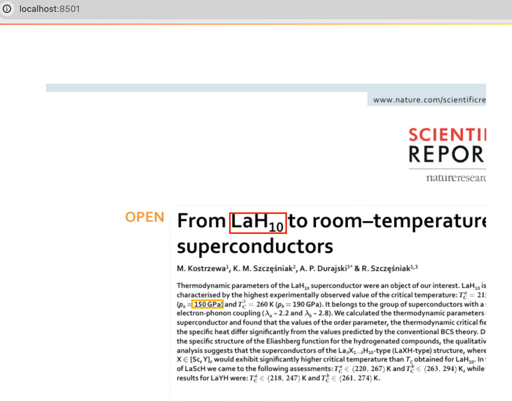

[](http://www.apache.org/licenses/LICENSE-2.0.html)
[](https://badge.fury.io/py/streamlit-pdf-viewer)
[](https://github.com/lfoppiano/streamlit-pdf-viewer/actions/workflows/ci-build.yml)
[](https://coveralls.io/github/lfoppiano/streamlit-pdf-viewer?branch=integration-tests)

# streamlit-pdf-viewer

Streamlit component that allows the visualisation and enrichment of PDF documents

**Work in progress**: We are early in the development, and we appreciate new contributors.

Currently, it has been tested on Chrome and Firefox. You can see an [application](https://github.com/lfoppiano/structure-vision) in action [here](https://structure-vision.streamlit.app/).



## Getting started

```sh
pip install streamlit-pdf-viewer
```

In your streamlit application, you can use it as:

```python
import streamlit as st
from streamlit_pdf_viewer import pdf_viewer

pdf_viewer("str, path or bytes")
```

## Options

### Params

In the following table the list of parameters that can be provided to the `pdf_viewer` function:

| name                    | description                                                                                                                                                                                                                                                                                                                                                                                                                                                                                                                                                                      |
|-------------------------|----------------------------------------------------------------------------------------------------------------------------------------------------------------------------------------------------------------------------------------------------------------------------------------------------------------------------------------------------------------------------------------------------------------------------------------------------------------------------------------------------------------------------------------------------------------------------------|
| input                   | The source of the PDF file. Accepts a file path, URL, or binary data.                                                                                                                                                                                                                                                                                                                                                                                                                                                                                                            |
| width                   | Width of the PDF viewer in pixels. It defaults to 700 pixels.                                                                                                                                                                                                                                                                                                                                                                                                                                                                                                                    |
| height                  | Height of the PDF viewer in pixels. If not provided, the viewer shows the whole content.                                                                                                                                                                                                                                                                                                                                                                                                                                                                                         |
| annotations             | A list of annotations to be overlaid on the PDF. Format is described here.                                                                                                                                                                                                                                                                                                                                                                                                                                                                                                       |
| pages_vertical_spacing  | The vertical space (in pixels) between each page of the PDF. Defaults to 2 pixels.                                                                                                                                                                                                                                                                                                                                                                                                                                                                                               |
| annotation_outline_size | Size of the outline around each annotation in pixels. Defaults to 1 pixel.                                                                                                                                                                                                                                                                                                                                                                                                                                                                                                       |
| rendering               | Type of rendering: `unwrap` (default), `legacy_iframe`, or `legacy_embed`. The default value, `unwrap` shows the PDF document using pdf.js, and supports the visualisation of annotations. Other values are `legacy_iframe` and `legacy_embed` which use the legacy approach of injecting the document into an `<embed>` or `<iframe>`. These methods enable the default pdf viewer of Firefox/Chrome/Edge that contains additional features we are still working to implement in this component. **NOTE**: Annotations are ignored for both 'legacy_iframe' and 'legacy_embed'. |
| pages_to_render         | Filter the rendering to a specific set of pages. By default all pages are rendered.                                                                                                                                                                                                                                                                                                                                                                                                                                                                                              |

### Annotation format 
The annotations format has been derived from the [Grobid's coordinate formats](https://grobid.readthedocs.io/en/latest/Coordinates-in-PDF/), which are described as a list of "bounding boxes".
The annotations are expressed as a dictionary of six elements, the page, x and y indicate the top left point. The color can be expressed following the html CSS convention. 

Here an example: 

```json
[
   {
      "page": 1,
      "x": 220,
      "y": 155,
      "height": 22,
      "width": 65,
      "color": "red"
   },
[...]
```

The example shown in our screenshot can be found [here](resources/annotations.json).

## Developers notes

### Environment

- Python >= 3.8
- Node.js >= 16
- Streamlit >= 1.28.2

### Configure environment for development

First, make sure that _RELEASE = False in `streamlit_pdf_viewer/__init__.py`. To run the component in development mode, use the following commands:

```shell
streamlit run streamlit_pdf_viewer/__init__.py

cd frontend
npm run serve
```

These commands will start the Streamlit application and serve the Node.js component. Please make sure you're in the correct directory before running these commands.

### Integrate into a streamlit application

1. Build the frontend part:

    ```shell
    cd frontend
    export NODE_OPTIONS=--openssl-legacy-provider
    npm run build 
    ```

1. Make sure that _RELEASE = True in `streamlit_pdf_viewer/__init__.py`.

2. move to the streamlit_application and run

    ```shell
    pip install -e {path of component}
    ```

### Release

```shell 
bump-my-version bump patch | minor | major
```

```shell
git push
git push --tags 
```
